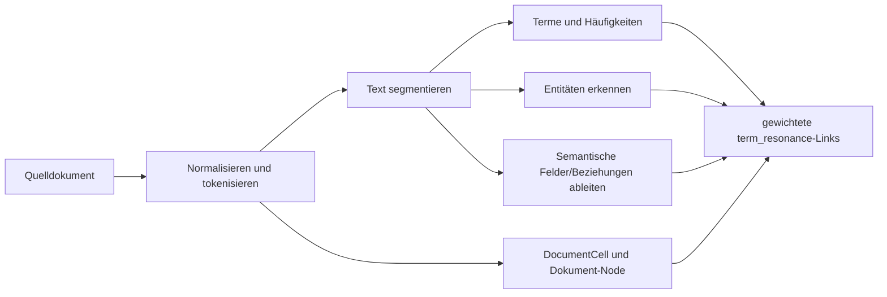

# MyceliaDB Enterprise – Architektur und Funktionsweise

Zur historischen Entwicklung aus der allgemeinen OpenCL-Compute-Schicht und zur klaren Abgrenzung von Direct GPU Ingest beziehungsweise Native-VRAM-Funktionen der früheren Plattform siehe [Herkunft der nativen Komponenten](HERKUNFT_NATIVE_KOMPONENTEN.md).

## 1. Warum MyceliaDB keine klassische Datenbank ist

MyceliaDB ist im Projekt weder eine relationale Datenbank noch lediglich ein Key-Value-Store. Die Engine verbindet zwei Betriebsarten:

1. **Expliziter Anwendungsgraph:** Das WebCMS legt stabile Nodes mit kontrollierten Namensräumen an und speichert technische Properties sowie verschlüsselte Fachobjekte. Dieser Teil übernimmt die Rolle der operativen Datenbank.
2. **Abgeleiteter Resonanzgraph:** Dokumente werden in Segmente, Terme, Entitäten, semantische Felder und gewichtete Beziehungen zerlegt. Suchanfragen starten Aktivität an passenden Knoten und lassen diese durch das Beziehungsnetz propagieren.

Diese Trennung ist entscheidend. Die neue Datenbankidee liegt vor allem im zweiten Modell; die WebCMS-Fachmodule nutzen aktuell vor allem das erste Modell. Beide leben in derselben nativen Engine, dürfen aber nicht in der Dokumentation vermischt werden.

## 2. Grundelemente der Engine

### 2.1 Node

Ein Node besteht nativ aus:

```text
id:         eindeutige String-ID
props:      Map<String, String>
energy:     Fließkommazahl
```

Die ID ist Primäradresse und zugleich Namensraumträger, beispielsweise `shop:product:<uuid>`. Properties sind Stringwerte. Strukturierte CMS-Daten werden deshalb nicht als native verschachtelte DB-Struktur gespeichert, sondern als verschlüsseltes JSON-Paket in der Property `data`.

`energy` ist ein temporärer bzw. berechneter Relevanzwert für Graphoperationen. Er ist kein Geldbetrag, keine Berechtigung und kein dauerhafter CMS-Status.

### 2.2 Link

Ein Link enthält:

```text
from:       Ausgangs-Node
to:         Ziel-Node
weight:     Gewicht, standardmäßig 1.0
kind:       Beziehungstyp, standardmäßig "mycelial"
```

Links sind gerichtet. Das Gewicht beeinflusst die Weitergabe von Energie. Der Beziehungstyp macht unterschiedliche semantische Aussagen unterscheidbar, etwa `contains_segment`, `term_resonance`, `mentioned_in` oder `relationship`.

### 2.3 Primär- und abgeleitete Strukturen

Zusätzlich zu Nodes und Links führt die Engine spezialisierte Strukturen:

- `DocumentCell`: Dokument-ID, Pfad, Typ, Text, Termhäufigkeiten, Segment-IDs und optionale Media-ID.
- `SegmentCell`: Segment-ID, zugehöriges Dokument, Titel und Text.
- `MediaAsset`: Quell-/Speicherpfad, MIME-Typ, SHA, Bytezahl und Dokumentbezug.
- invertierte Termindizes,
- Segmentindex,
- Adjazenzliste für Graphnavigation.

Die spezialisierten Strukturen beschleunigen Import, Suche und Rekonstruktion. Sie ersetzen die generischen Nodes nicht, sondern erzeugen bzw. ergänzen den Graphen.

## 3. Manuelle Nodes: das operative CMS-Modell

Das CMS erzeugt einen Node bei Bedarf über `SPAWN <id>`. Die Engine markiert ihn als manuell, setzt initial `kind=manual` und `label=<id>`. Danach werden Properties mit `MUTATE` gesetzt.

Ein typischer logischer Node sieht so aus:

```text
ID: shop:product:4f...e9
kind = product
shop_idx = <64-stelliger HMAC-Hexwert>
owner_idx = <64-stelliger HMAC-Hexwert>
slug_idx = <64-stelliger HMAC-Hexwert>
data = TUNNUzM...<Base64url-MCMS3-Paket>
```

Die Properties lassen drei Klassen erkennen:

- **Routing/Typ:** `kind`, manchmal `scope`, `slot` oder `parent_kind`.
- **Suchbeziehungen:** `*_idx`, vom Security-Layer erzeugte Blindindizes.
- **Nutzdaten:** `data`, ein vollständig authentifiziertes und verschlüsseltes Fachobjekt.

### 3.1 Erzeugen und Ändern

- `SPAWN id` legt einen manuellen Node an.
- `MUTATE id key value` ändert genau eine Property eines vorhandenen Nodes.
- `GET id` liefert Energie und Properties.
- `LIST_NODES prefix` listet passende IDs.

Der Python-Client `ensure_node` verwendet zunächst die Node-Liste und erzeugt den Node nur, wenn er fehlt. Danach werden Properties einzeln gesetzt.

### 3.2 Löschen

`ERASE_NODE id` ist nur für manuelle Nodes zulässig. Der Befehl entfernt:

- den Node,
- seine Kennzeichnung als manueller Node,
- alle eingehenden und ausgehenden Links,
- die davon betroffenen Adjazenzinformationen.

Diese echte Löschung ist Grundlage für Konto-Hard-Delete und die Entfernung von Medien- oder Unterobjekten. Fachliche Soft Deletes, etwa bei CMS-Seiten, können zusätzlich als verschlüsseltes Statusfeld existieren.

### 3.3 Abfragen und heutige Grenzen

Das CMS besitzt noch keinen DB-seitigen Befehl wie `WHERE shop_idx = ...`. Stattdessen listet es alle IDs eines engen Präfixes, lädt deren öffentliche Properties und vergleicht den Blindindex im Prozess.

Komplexität einer solchen Suche ist grob `O(n)` für `n` Nodes dieses Typs, zuzüglich Netzwerk-Roundtrips. Das ist für kleine bis mittlere lokale Installationen verständlich und überprüfbar, aber keine endgültige Indexarchitektur für Millionen Objekte.

## 4. Der Resonanzgraph

### 4.1 Grundidee

Klassische Volltextsuche zählt üblicherweise Treffer von Suchbegriffen in Dokumenten. MyceliaDB erweitert dieses Modell zu einem gewichteten Netz:

- Ein Dokument wird in Bedeutungsträger zerlegt.
- Bedeutungsträger werden als Nodes modelliert.
- Beziehungen erhalten Typ und Gewicht.
- Eine Query speist Energie an passenden Nodes ein.
- Energie verteilt sich mit Dämpfung über verknüpfte Nodes.
- Dokumente und Segmente werden anhand der resultierenden Energie gerankt.

Dadurch kann ein Ergebnis relevant werden, obwohl nicht nur eine exakte Zeichenfolge, sondern auch eine eng verbundene Entität, ein Feld oder eine Beziehung getroffen wurde.

### 4.2 Ingestion-Pipeline

Beim Import eines Text-, SQL- oder OCR-Dokuments führt die Engine konzeptionell folgende Schritte aus:



Im Detail:

1. Der Text wird tokenisiert; Termhäufigkeiten werden berechnet.
2. Ein `DocumentCell` und ein Dokument-Node entstehen.
3. Der Text wird in Segmente zerlegt. Jedes Segment wird als `SegmentCell` und Node angelegt.
4. Dokument und Segment werden typischerweise über `contains_segment` mit Gewicht 0,95 verbunden.
5. Pro Segment werden bis zu 48 relevante Terme als Term-Nodes berücksichtigt.
6. Frequenzabhängige `term_resonance`-Links verbinden Segment und Terme.
7. Erkannte Entitäten erzeugen Evidenz- und `mentioned_in`-Beziehungen.
8. Gemeinsam auftretende Entitäten können Co-Occurrence-Verbindungen erhalten.
9. Erkannte Schlüssel-/Wert- oder Rollenstrukturen erzeugen semantische Feld-, Wert-, Rollen- und Beziehungs-Nodes.
10. Dokumentweite Feldvererbung führt auch Layouts zusammen, bei denen Überschrift und Wert durch OCR oder Segmentierung getrennt wurden.

Die Heuristiken sind deterministischer C++-Code. Sie sind kein externes Large Language Model und benötigen keinen Cloud-Dienst.

### 4.3 OCR und Medien

Die OCR-Funktion bindet Tesseract als externes Kommandozeilenwerkzeug ein. Das Bild wird in den kontrollierten Medienbereich der DB kopiert, OCR-Text wird extrahiert und anschließend wie ein Dokument indiziert. Der Media-Datensatz enthält unter anderem gespeicherten Pfad, MIME-Typ, SHA und Bytezahl.

Dieser native OCR-Medienpfad ist von `SecureMediaRepository` des WebCMS zu unterscheiden. CMS-Bilder werden dekodiert, normalisiert, Base64-kodiert und innerhalb eines MCMS3-Payloads als manuelle Nodes gespeichert. Sie werden nicht automatisch per OCR in den Resonanzgraphen aufgenommen.

## 5. Resonanzsuche Schritt für Schritt

Eine Query arbeitet nicht wie SQL. Vereinfacht geschieht:

1. Querytext normalisieren und in Terme zerlegen.
2. Direkte Treffer in Term- und Segmentindizes als Startpunkte wählen.
3. Teiltreffer in Labels, Entitäten oder Beziehungen ergänzen.
4. Nahe beieinander liegende Treffer innerhalb eines Segments höher bewerten.
5. Startenergie in den Graphen einspeisen.
6. Energie bis zu Tiefe 4 weitergeben.
7. Pro Schritt mit dem Faktor 0,62 dämpfen und zusätzlich mit dem Linkgewicht multiplizieren.
8. resultierende Dokument-/Segmentenergie aggregieren.
9. bis zu zwölf Treffer nach Relevanz ausgeben.
10. Optional erklärt `EXPLAIN_RESONANCE` die verwendeten Evidenzen.

Schematisch:

```text
E(neu, Ziel) += E(Quelle) × Linkgewicht × 0,62
```

Die echte Implementierung berücksichtigt Besuchs-/Tiefenlogik und mehrere Seed-Arten. Die Formel erklärt das Prinzip, ist aber keine vollständige formale Spezifikation jeder Rankingzeile.

### 5.1 Graphnavigation

Zusätzliche Befehle erlauben:

- `TRACE` für eine breitensuchende Navigation bis zu einer Tiefe,
- `PULSE` zum Einspeisen und Propagieren von Energie,
- `GET_NEIGHBORS` für direkte Nachbarschaft,
- `FIELD_STATUS` für semantische Feldinformationen,
- `GET_DOC` und Medieninformationen für Primärdaten,
- `EXPLAIN_RESONANCE` für nachvollziehbare Trefferbegründung.

## 6. Steuerprotokoll

### 6.1 Transport

- TCP auf `127.0.0.1:4555`.
- UTF-8-Zeilenprotokoll.
- Eine Befehlszeile, eine Antwortzeile bzw. definierte Antwortstruktur.
- Maximale Client-Befehlszeile: 1 MiB.
- CR, LF und NUL sind in Parametern verboten.
- Anführungszeichen und Backslash-Escaping erlauben Werte mit Leerzeichen.

Das Protokoll ist bewusst lokal. Es bietet keine TLS-Schicht und darf nicht an ein externes Interface gebunden werden.

### 6.2 Authentifizierung

Nach Verbindung sendet der Server:

```text
MYCELIADB ENTERPRISE SECURE AUTH_REQUIRED
```

Der Client antwortet:

```text
AUTH <per-start-token>
```

Der Token muss serverseitig mindestens 48 Zeichen lang sein. Der Vergleich erfolgt konstantzeitnah. Bei Fehler wartet der Server 250 ms und schließt die Verbindung. Vor Authentifizierung gelten kurze Timeouts; nach erfolgreicher Anmeldung längere operative Timeouts.

### 6.3 Wichtige Befehlsgruppen

| Gruppe | Befehle | Zweck |
|---|---|---|
| Zustand | `PING`, `GPU_STATUS`, `HELP` | Bereitschaft und Fähigkeiten |
| Manuelle Daten | `SPAWN`, `MUTATE`, `GET`, `ERASE_NODE` | operativer Node-Speicher |
| Graph | `LINK`, `LIST_LINKS`, `TRACE`, `PULSE` | Beziehungen und Energie |
| Auflistung | `LIST_NODES`, `LIST_DOCS` | IDs/Primärdaten finden |
| Ingestion | `IMPORT`, `INGEST`, `OCR` | Dokumentgraph erzeugen |
| Suche | `SEARCH`, `QUERY_FIELD`, `EXPLAIN_RESONANCE` | Resonanzabfrage |
| Details | `GET_DOC`, `GET_NEIGHBORS`, `FIELD_STATUS` | Ergebnisanalyse |
| Persistenz | `SAVE_DB`, `LOAD_DB`, `CLEAR_DB` | Snapshot-Lebenszyklus |

Aliase wie `SAVE`/`CHECKPOINT`, `LOAD`/`RESTORE` und `QUERY` werden ebenfalls akzeptiert. Für Produktionsintegration sollte dennoch die dokumentierte kanonische Form verwendet werden.

### 6.4 Parallelität

Der Server kann bis zu 32 Clientthreads halten. Jeder authentifizierte Client besitzt seine Verbindung. Der Aufruf der Engine ist jedoch durch einen Mutex geschützt. Die Vorteile mehrerer Verbindungen sind daher vor allem:

- kein ständiger TCP-/AUTH-Aufbau,
- keine gegenseitige Blockade schon im Python-Verbindungshandling,
- robuste Wiederverwendung pro Requestthread.

Sie bedeuten nicht, dass mehrere Engine-Mutationen gleichzeitig denselben Graphzustand verändern.

## 7. Native V2-Persistenz

### 7.1 Snapshot-Aufbau

Ein V2-Snapshot beginnt mit:

```text
MYCELIADB_SNAPSHOT_V2
```

Danach folgen logisch diese Bereiche:

```text
DOC_COUNT / DOC ...
MEDIA_COUNT / MEDIA ...
MANUAL_NODE_COUNT / MANUAL_NODE ...
PROP ...
MANUAL_LINK_COUNT / MANUAL_LINK ...
```

Die konkrete Kodierung escaped bzw. quoted Werte nach den Regeln der nativen Engine. Anwendungen sollten Snapshots nicht selbst editieren.

### 7.2 Was direkt gespeichert wird

- Dokument-Primärdaten,
- Media-Metadaten,
- manuelle Nodes und ihre Properties,
- manuelle Links.

Der große abgeleitete Dokument-/Segment-/Term-/Entitätsgraph wird nicht redundant vollständig als Primärzustand gespeichert. Beim Laden werden Dokumente erneut indiziert und die abgeleiteten Strukturen rekonstruiert. Das reduziert doppelte Wahrheit und ermöglicht eine konsistente Wiederherstellung aus Primärdaten.

### 7.3 Speichervorgang

1. Zielpfad wird gegen `MYCELIA_DB_STORAGE_ROOT` geprüft.
2. Der Zustand wird in eine temporäre Datei geschrieben.
3. Erst nach erfolgreichem Abschluss ersetzt die temporäre Datei atomar den Ziel-Snapshot.
4. Zugehörige native Mediendateien werden in einen `<snapshot>.media`-Bereich kopiert.
5. Auf CMS-Ebene wird anschließend ein HMAC-Sidecar erzeugt.

Das temporär-plus-atomar-Muster verhindert, dass ein fehlgeschlagener Schreibvorgang den letzten guten Snapshot einfach abschneidet.

### 7.4 Ladevorgang

1. Snapshot-Pfad und Format prüfen.
2. V1- oder V2-Strukturen zunächst in temporäre Sammlungen parsen.
3. Erst nach erfolgreichem Parsen den aktuellen Engine-Zustand leeren.
4. Medien und Dokumente laden.
5. Dokumente erneut indizieren und abgeleitete Graphen aufbauen.
6. Manuelle Nodes und Links wiederherstellen.
7. Bei einer ID-Kollision hat der explizite manuelle Node Vorrang.

Das Parsen vor dem Leeren reduziert das Risiko, bei einem offensichtlich beschädigten Snapshot den laufenden Zustand zu verlieren.

### 7.5 Vertraulichkeit und Integrität des Snapshots

Der Snapshot ist nicht als Ganzes durch die DB verschlüsselt. CMS-Nutzdaten in `data` bleiben MCMS-verschlüsselt. Sichtbar bleiben unter anderem:

- Node-IDs und Präfixe,
- Property-Namen,
- bewusst öffentliche technische Werte,
- Blindindizes,
- Anzahl und ungefähre Struktur der Datensätze,
- native Dokumentdaten, falls die Ingestion-Funktionen separat verwendet werden.

Die CMS-Schicht schützt die Integrität der Snapshotdatei mit einem schlüsselgebundenen HMAC-Sidecar. Vertraulichkeit des gesamten Backups erfordert zusätzlich geschützten Speicher bzw. Datenträgerverschlüsselung.

## 8. GPU-Rolle

Die DB versucht eine GPU-Bridge (`mycelia_gpu_envelope.dll` oder `CC_OpenCl.dll`) sicher zu laden und prüft die PE-Architektur. Ist sie nicht verfügbar, meldet sie `GPU_BRIDGE FALLBACK cpu-propagation`.

Wichtig: Die aktuelle Query-Energiediffusion ist C++-CPU-Code. Das Laden der Bridge belegt nicht, dass jede Suche oder CMS-Abfrage auf der GPU läuft. Insbesondere manuelle Node-Operationen, Präfixlisten und Propertyzugriffe sind normale CPU-/Speicheroperationen.

## 9. Sicherheits- und Designbewertung

### Stärken

- kleine, nachvollziehbare lokale Protokollfläche,
- keine offen erreichbare DB-Schnittstelle,
- per Start erneuerte Capability,
- explizite Trennung von Primär- und abgeleitetem Graph,
- native Hard-Delete-Funktion,
- atomarer Snapshot-Austausch,
- erklärbare, deterministische Resonanzlogik,
- keine Cloudabhängigkeit für semantische Strukturierung.

### Bewusste Grenzen

- keine mehrbefehlige ACID-Transaktion,
- globaler Engine-Mutex,
- CMS-Suchen häufig als Präfixscan plus Einzel-GET,
- keine eingebaute Netzwerkverschlüsselung, da Loopback-Vertrag,
- Snapshotmetadaten nicht vollständig vertraulich,
- heuristische Semantik ist domänenabhängig und nicht gleichbedeutend mit Sprachverständnis,
- native Dokumentingestion und verschlüsselte CMS-Objekte sind noch nicht automatisch gekoppelt.

## 10. Sinnvolle Weiterentwicklung

Ohne das Sicherheitsmodell zu schwächen, wären besonders wertvoll:

1. native indexierte Suche nach Property/Blindindex,
2. `GET_MANY` und atomare Batch-Mutationen,
3. eine Transaktions- oder Write-Set-Schnittstelle,
4. versionierte Schema-/Migrationsmetadaten pro Nodeklasse,
5. Metriken für Befehlsdauer, Queuezeit und Snapshotdauer ohne Nutzdatenlogging,
6. getrennte Locks oder immutable Read-Snapshots für parallele Leseabfragen,
7. explizite Schnittstelle, um ausgewählte, freigegebene CMS-Inhalte in den Resonanzgraph zu überführen,
8. optional verschlüsselte Gesamtsnapshots zusätzlich zur heutigen Payload-Verschlüsselung.

## 11. Kernaussage

MyceliaDB ist heute ein real implementierter nativer Graphspeicher mit einem ungewöhnlichen zweiten Suchmodell. Für das WebCMS dient sie als alleinige, manuell adressierte Persistenz. Für importierte Dokumente erzeugt sie zusätzlich ein rekonstruktionsfähiges Bedeutungsnetz, das Relevanz als verteilte Energie über gewichtete Beziehungen bestimmt. Die Innovation liegt nicht in einem neuen Namen für SQL, sondern in der Verbindung aus explizitem Graphzustand, abgeleiteter Semantik und Resonanzsuche.
