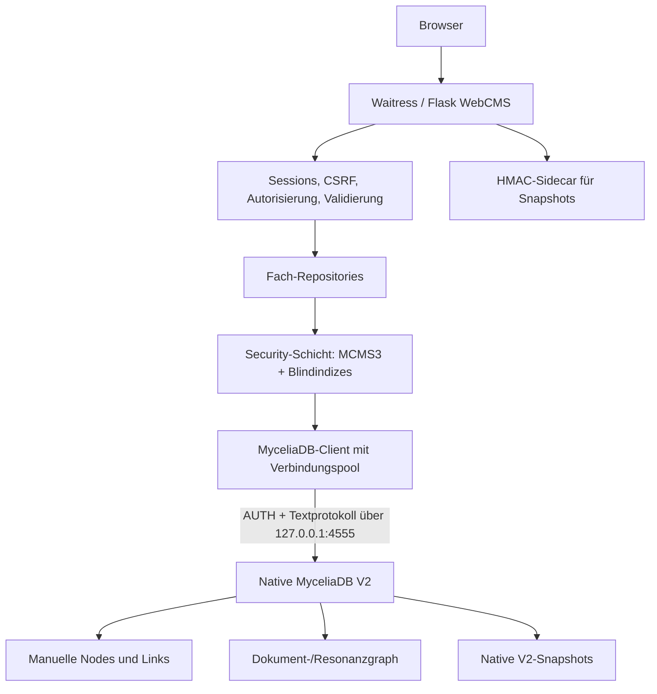

# Technische Gesamtdokumentation – Mycelia WebCMS v0.8.0

Stand: 1. Oktober 2026

Diese Dokumentation beschreibt den tatsächlich implementierten Stand des Projekts. Sie trennt bewusst zwischen heute ausgeführtem Code, Kompatibilitätswegen für historische Daten und weitergehenden Konzepten. Maßgeblich sind die Python-Quellen unter `cms/` und die mitgelieferten nativen Quellen unter `third_party/`.

## 1. Zweck und Systemidee

Mycelia WebCMS ist keine einzelne CMS-Anwendung, sondern eine lokale Content-, Commerce- und Community-Plattform. Sie umfasst:

- CMS-Seiten und Medien,
- Benutzerkonten und Datenschutzfunktionen,
- Shops, Produkte, Bestellungen, Blog und Newsletter,
- Creator-Profile und Mitgliederbereiche,
- Downloads, Dokumente und Support-Tickets,
- Forum, Knowledge Base und Community-Feed.

Die besondere Architektur besteht aus zwei eigenen nativen Komponenten:

1. **Mycelia Security SDK** schützt die fachlichen Datensätze vor dem Speichern. Neue Daten werden durch den MCMS3-Paketaufbau verschlüsselt und authentifiziert. Historische MCMS1- und MCMS2-Pakete können weiterhin gelesen werden.
2. **MyceliaDB Enterprise** ist die alleinige Persistenzschicht. Das CMS verwendet weder SQL noch SQLite noch eine parallele JSON-Datenbank. Die Datenbank ist ein graphorientierter Speicher mit manuellen Anwendungs-Nodes und einem zusätzlich verfügbaren, aus Dokumenten abgeleiteten Resonanzgraphen.

Ausführliche Teildokumente:

- [MyceliaDB: Datenmodell, Protokoll, Resonanz und Persistenz](MYCELIADB_ARCHITEKTUR.md)
- [Security SDK: Schlüssel, MCMS1/2/3, Integrität und Blindindizes](SECURITY_SDK.md)
- [Herkunft der nativen Komponenten und GPU-Architekturentwicklung](HERKUNFT_NATIVE_KOMPONENTEN.md)
- [Betrieb, Start, Backup, Recovery und Sicherheitsgrenzen](BETRIEB_UND_SICHERHEIT.md)
- [Fachmodule, Node-Namensräume und Datenflüsse](DATENMODELL_UND_MODULE.md)

## 2. Gesamtarchitektur

### 2.1 Schichten und Verantwortlichkeiten

| Schicht | Implementierung | Verantwortung |
|---|---|---|
| HTTP-Prozess | Flask, Waitress | Routing, Rendering, Sessions, Request-Grenzen |
| Hardening | `cms/hardening.py`, App-Hooks | CSRF, Rate Limits, Host-Prüfung, Security Header |
| Fachlogik | Module und Repositories | Berechtigungen, Zustände, Validierung, Datenschutz |
| Kryptografie | `cms/security.py`, native Security DLL | Verschlüsselung, Authentifizierung, Blindindizes, Legacy-Lesen |
| DB-Client | `cms/db.py` | authentifizierte Verbindungen, Protokollkodierung, Pooling |
| DB-Engine | natives C++ | Graphzustand, Befehle, Suchgraph, Snapshot-Format |
| Backup-Schicht | `cms/backup.py` | Checkpoint-Aufruf und zusätzliche Snapshot-Authentifizierung |

Keine einzelne Schicht ersetzt die andere. Beispielsweise verhindert Verschlüsselung nicht, dass ein angemeldeter Benutzer über eine fehlerhafte Route fremde Daten anfordert. Deshalb bleiben fachliche Autorisierung und Kryptografie getrennte, beide notwendige Kontrollen.

### 2.2 Historischer Kontext der nativen Schicht

Die OpenCL-/Security-Komponenten wurden nicht ursprünglich allein für dieses CMS geschaffen. Sie stehen in der Entwicklungslinie des GPU-Treibers [CC_OpenCl_Enterprise](https://github.com/kruemmel-python/CC_OpenCl_Enterprise), des eigenständigen [Mycelia-Security-SDK](https://github.com/kruemmel-python/Mycelia-Security-SDK) und der früheren SQL-freien Plattform [CMS-MyceliaDB-Enterprise](https://github.com/kruemmel-python/CMS-MyceliaDB-Enterprise). Das Security SDK lieferte die historische GPU-Kontext-/Seed-/Streaming-API; v0.8.0 härtet sie mit 256-Bit-Keys, HMAC und dem reproduzierbaren MCMS3-Pfad. Direct GPU Ingest, Zero-Logic Gateway und Strict-VRAM-Zertifizierung gehören dagegen zur früheren Plattform und sind nicht als heutige v0.8.0-Funktionen zu verstehen. Herkunft, Unterschiede und übernommene Prinzipien beschreibt [Herkunft der nativen Komponenten](HERKUNFT_NATIVE_KOMPONENTEN.md).

## 3. Prozess- und Vertrauensgrenzen

Beim normalen Start existieren zwei Prozesse:

- `runtime/myceliadb-server.exe` bindet ausschließlich an `127.0.0.1:4555`.
- `run.py` startet das WebCMS über Waitress mit acht Worker-Threads.

`start.ps1` erzeugt bei jedem Start einen zufälligen 256-Bit-Datenbanktoken. Er wird nicht in eine Datei geschrieben, sondern nur als Umgebungsvariable an beide Kindprozesse vererbt. Der CMS-Prozess akzeptiert die Datenbank erst, wenn Banner, Authentifizierung und Capability-Antwort stimmen.

Die zentralen Grenzen sind:

- **Internet zu WebCMS:** potentiell feindliche Requests; Eingaben, Session, CSRF und Berechtigungen müssen geprüft werden.
- **WebCMS zu Security SDK:** Klartext existiert kurzfristig im Python-Prozess; die Datenbank erhält primär Ciphertext und Blindindizes.
- **WebCMS zu MyceliaDB:** lokaler, token-authentifizierter Kanal; Loopback reduziert die Angriffsfläche, ist aber keine Transportverschlüsselung.
- **Arbeitsspeicher zu Snapshot:** DB-Daten werden nativ serialisiert; der CMS-Backupmanager authentifiziert die Datei zusätzlich mit einem HMAC-Sidecar.
- **Betriebssystem:** `.env`, Schlüssel, Prozesse und Backupverzeichnis benötigen Windows-ACLs. Die Installation setzt diese restriktiv.

## 4. Typischer Schreibvorgang

Am Beispiel einer CMS-Seite:

1. Route und Repository validieren ID, Titel, Slug, Status und Richtext.
2. Das Repository bildet die Node-ID `cms:page:<uuid>`.
3. Suchbare Gleichheitsmerkmale werden als namespaced Blindindex erzeugt, etwa `slug_idx`.
4. Das vollständige Fachobjekt wird als kompaktes JSON serialisiert.
5. Die Security-Schicht erzeugt ein zufälliges Nonce, einen datensatzgebundenen Schlüssel, MCMS3-Ciphertext und einen Authentifizierungstag.
6. Das Repository setzt minimale Eigenschaften wie `kind`, `slug_idx` und `data` am MyceliaDB-Node.
7. Nach erfolgreicher fachlicher Änderung wird ein nativer Checkpoint erzeugt.
8. Der Backupmanager schreibt bzw. erneuert die HMAC-Sidecar-Datei.

Die Datenbank sieht damit die Node-ID, technische Property-Namen, ausgewählte Kategorien und deterministische Blindindizes. Titel, Inhalt, E-Mail-Adressen, Bestelldetails und die übrigen Felder liegen im verschlüsselten `data`-Paket.

## 5. Typischer Lesevorgang

1. Das Repository listet Nodes eines kontrollierten Präfixes oder lädt eine bekannte Node-ID.
2. Bei einer Gleichheitssuche berechnet es aus dem Suchwert denselben Blindindex und vergleicht ihn mit der passenden Property.
3. Das `data`-Paket wird Base64url-dekodiert und anhand der Versionskennung eingeordnet.
4. Vor jeder Entschlüsselung wird der HMAC in konstanter Vergleichsfunktion geprüft.
5. Die Record-ID ist Teil der Authentifizierung. Ein gültiger Ciphertext kann deshalb nicht unbemerkt auf einen anderen Node verschoben werden.
6. Erst nach erfolgreicher Authentifizierung wird entschlüsselt, als UTF-8 dekodiert und als JSON-Objekt akzeptiert.
7. Das Repository konstruiert das erwartete Datenmodell und prüft sicherheitsrelevante Felder erneut.

Fehler werden nicht als leere oder vermeintlich gültige Daten behandelt. Beschädigte, falsch gebundene oder mit einem falschen Schlüssel gelesene Pakete führen zu einem Fehler.

## 6. Konsistenzmodell und Transaktionsgrenze

MyceliaDB stellt im CMS-Pfad einzelne Befehle wie `SPAWN`, `MUTATE` und `ERASE_NODE` bereit. Es gibt im aktuellen Protokoll keine mehrbefehlige ACID-Transaktion mit Commit/Rollback. Daraus folgen wichtige Eigenschaften:

- Ein Fachobjekt wird über mehrere Property-Befehle aufgebaut.
- Ein Prozessabbruch zwischen diesen Befehlen kann einen unvollständigen Node hinterlassen.
- Repositories schreiben `data` als vollständiges, authentifiziertes Objekt; Leser überspringen Nodes ohne `data` oder schlagen bei ungültigem Inhalt fehl.
- Komplexe Abläufe führen eigene Bereinigung aus, soweit implementiert.
- Nach erfolgreichen Änderungen wird ein vollständiger nativer Checkpoint erzeugt.
- Ein möglicherweise bereits ausgeführter Schreibbefehl wird nach einem Verbindungsabbruch nicht automatisch wiederholt.

Das ist ein bewusst anderes Modell als eine relationale Transaktion. Für zukünftige hochgradig gekoppelte Änderungen wäre ein nativer Batch-/Transaktionsbefehl eine sinnvolle Erweiterung.

## 7. Parallelität und Leistung

Waitress verarbeitet Requests parallel. Der Python-DB-Client hält einen kleinen Pool dauerhaft authentifizierter TCP-Verbindungen. Dadurch entfallen Verbindungsaufbau und Authentifizierung pro Einzelbefehl.

Die native Datenbank akzeptiert mehrere Clients, schützt den Engine-Zustand jedoch mit einem zentralen Mutex. Befehle werden innerhalb der Engine daher effektiv serialisiert. Außerdem basieren viele Repository-Abfragen derzeit auf:

1. `LIST_NODES <prefix>`,
2. anschließendem `GET` für jeden Kandidaten,
3. Property-/Blindindex-Vergleich im Python-Prozess.

Das ist funktional klar und sicher, skaliert aber linear mit der Zahl der Nodes im jeweiligen Präfix. Blindindizes vermeiden Klartext in der DB, sind derzeit jedoch noch kein nativer B-Tree- oder Hashindex. Für große Datenmengen wären serverseitige Property-Indexbefehle, Batch-Reads und atomare Mehrfachmutationen die wichtigsten Weiterentwicklungen.

Die GPU ist nicht die Ursache normaler CRUD-Latenz. Neue MCMS3-Datensätze werden CPU-seitig mit HMAC-SHA256-Streams verarbeitet. Auch die aktuelle Resonanzdiffusion der DB läuft in C++; der geladene GPU-Treiber stellt im heutigen Code vor allem eine optionale Bridge bzw. Capability dar.

## 8. Fail-closed-Prinzip

Der Start wird abgebrochen, wenn unter anderem:

- der Master-Key nicht genau 32 Byte als Hexwert ergibt,
- der Session-Key zu kurz ist,
- die DB nicht auf Loopback konfiguriert ist,
- die native DB-Runtime oder ihr Build-Marker fehlt,
- der DB-Port bereits durch einen fremden Prozess belegt ist,
- Authentifizierung oder Capability-Prüfung scheitert,
- die Security-SDK-Capabilities für historische Pfade nicht stimmen,
- ein vorhandener Live-Snapshot keine gültige HMAC-Sidecar besitzt,
- ein öffentlicher Nicht-Loopback-Betrieb ohne erwartete Proxy-/HTTPS-Konfiguration versucht wird.

Fail-closed bedeutet hier: Das System startet nicht mit stillschweigend reduzierter Sicherheit.

## 9. Implementierter Stand versus Konzept

| Thema | Heute implementiert | Nicht daraus ableiten |
|---|---|---|
| CMS-Persistenz | manuelle Nodes, Properties, verschlüsselte Payloads | keine relationale SQL-Schicht |
| Suche im CMS | Präfixscan plus Blindindexvergleich | noch kein nativer Sekundärindex |
| Semantische DB | Ingestion, abgeleiteter Graph, Energiediffusion | CMS-Fachobjekte werden nicht automatisch semantisch indiziert |
| GPU | Legacy-SDK-Pfade und optionale DB-Bridge | normale Seitenaufrufe laufen nicht als GPU-Datenbankquery |
| Verschlüsselung | MCMS3 für neue Datensätze | MCMS2 ist nicht mehr das aktuelle Schreibformat |
| Legacy | MCMS1/2 werden nach Authentifizierung gelesen | kein automatisches Umschreiben allein beim Lesen |
| Snapshot | natives V2-Format plus CMS-HMAC | der gesamte Snapshot ist nicht als ein einzelner Blob verschlüsselt |
| Datenschutz | Export, Hard Delete, gezielte Anonymisierung | historische, ausdrücklich aufbewahrte Backups verschwinden nicht magisch ohne Löschprozess |

## 10. Quellcode-Navigation

- Anwendungserzeugung: `cms/app.py`
- Konfiguration: `cms/config.py`
- Datenbankclient: `cms/db.py`
- Kryptografische Hülle: `cms/security.py`
- Snapshotmanager: `cms/backup.py`
- Allgemeine CMS-Daten: `cms/repository.py`
- Sichere Medien: `cms/media.py`, `cms/media_routes.py`
- Shop-/Kontodaten: `cms/modules/webshop/`
- Plattformdaten: `cms/modules/ecosystem/`
- Native Security API: `third_party/Mycelia-Security-SDK_v2_secure/`
- Native Datenbank: `third_party/MyceliaDB_Enterprise_Studio_v0_2_secure/`
- Installation und Start: `install.ps1`, `start.ps1`
- Recovery: `recover_mcms2.ps1`, `build_recovery_v070.ps1`, `MCMS3_RECOVERY_MIGRATION.md`

## 11. Terminologie

**Node:** durch eine eindeutige String-ID adressiertes Objekt mit Properties und Energie.

**Manueller Node:** explizit durch einen Client angelegter Node. Die CMS-Datensätze gehören zu dieser Klasse und werden direkt im Snapshot gespeichert.

**Abgeleiteter Node:** beim Dokumentimport erzeugter Dokument-, Segment-, Term-, Entitäts- oder Feldknoten. Er kann aus Primärdaten rekonstruiert werden.

**Link:** gerichtete, gewichtete Beziehung zwischen zwei Nodes mit einem Typ (`kind`).

**Resonanz:** Suchverfahren, bei dem Query-Energie an passenden Startpunkten eingespeist und gewichtet über den Graphen verteilt wird.

**Blindindex:** deterministischer, schlüsselgebundener HMAC eines normalisierten Suchwerts. Er erlaubt Gleichheitsvergleich ohne Speicherung des Klartexts.

**MCMS-Paket:** Base64url-kodierter, versionierter Container aus Versionskennung, Nonce, Ciphertext und HMAC-Tag.

**Checkpoint/Snapshot:** von der nativen DB geschriebene Zustandsdatei im V2-Format.
